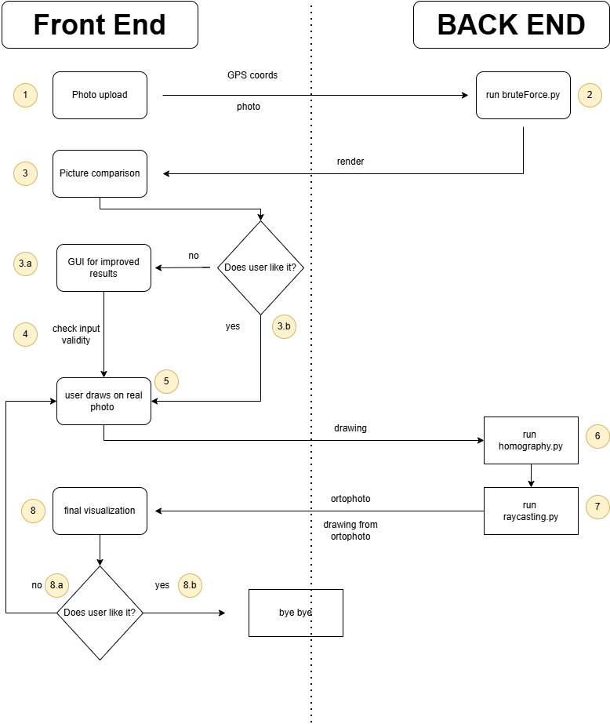

## Extract camera parameters

The goal of this project is to develop an app that allow users to draw over a picture and then visualize the results of the drawing projected on an ortographic photo. 
One of the main technical problem is to find the camera's extrinsic and intrisic properties given an input photo and this is the main goal of this repo, along some smaller details. We ask the user to share the position of where the photo has been taken place (and other extra parameters if presents). To retrieve the camera's properties we pose an optimization problem using the average distance between feature points extracted from the virtual and the input image. As a feature extractor we use [Robust Feature Detector and Descriptor using Deformable Transformer](https://github.com/xtcpete/rdd).

The system developed highly reliase on having "good" initial GPS coordinates, since this unfortunately is not often the case, we also allow the user to refine the solution found by the algorithms through an interactive GUI. A possible demo of such interactive GUI can be found [here](https://github.com/osprean/image-to-coords-gui.git) (check the branch new_gui).   

## Installation

### Create conda env
conda create -n fcp python=3.10 pip

conda activate fcp

### Install CUDA 
conda install -c nvidia/label/cuda-11.8.0 cuda-toolkit
### Install torch
pip install torch==2.5.1 torchvision==0.20.1 torchaudio==2.5.1 --index-url https://download.pytorch.org/whl/cu118
### Install all dependencies
pip install -r requirements07.txt

### Install Blender
pip install bpy==3.6.0 --extra-index-url https://download.blender.org/pypi/
<!-- ### Install pandas 2.3.3 -->
<!-- pip install pandas==2.3.3 -->

Compile custom operations.
You don't have to compile them to run RDD, but it is recommended for better performance.
cd ./RDD/models/ops
pip install -e .

# System flux
In the following we will briefly describe the system flux of the application and how is split between frontend and backend. 

1) User upload picture.
2) Back end is called passing coordinates in GPS format (lon/lat in decimal degree), beware of degrees minutes second format. The backend also receives the uploaded picture.
3) After the scrip terminates, the backend pass the best render and ask user if it satisfied. The fron-end should ask if the two images (the real and the render) have the same perspective or something similar. Two outcomes are expected:   
3.a) The user is not satisfied--> we setup a GUI initialized with the value found by the algorithms. Once the user is satisfied with the results (or simply give up), we send the new camera's parameters to the backend.
3.b) The user is satisfied --> we go to step 4)
4) We check at the backend that the new parameters are legits: i.e. the distance is less then a treshold from the initial coords and that the new render obtained with the new parameters is still inside a certain proximity in the loss landscape to the render obtained through the algorithm.
5) We let the user draw over the photo. Once the user is satisfied we send to the backend the drawing (as a .png with alpha).
6) At backend we calculate the correction factor (homography) and project the drawings to the ortophoto.
7) Run raycasting.py to project the drawing on the ortophoto.    
8) We visualize the results at the frontend and ask if user is satisfied.
8.a) If user is not satisfied then we repeat from point 5 (or maybe 3).
8.b) If user is satisfied we let them download the ortophoto with the drawing.

# Files system
The project has the following folders:
- weights: stores the pre-trained weights used by the feature extractor
- RDD: holds the files used for installing the feature extractor (RDD)
- Configs: hold the file to configure the feature extractor
- third-party: it's used again by the feature extractor
- locations: inside this folder the intermediate renders and files are generated. These files are not needed once the script has finished.
- images_DB: our small test database.
- coord2image.ipynb: this notebook is used to take the input coordinates (hardcoded in a dictionary inside the notebook itself) and download the ortophoto and the digital terrain model. 

# Usage
1) Use the jupyternotebook "coord2image" to create the folder system and download the ortophoto and the digital terrain model. There is a dictionary of hardcoded coordinates position associated with an image inside the images_DB folder. 
2) Run the script "bruteForce.py". Check that the variable LOCATIONS_PATH is set correctly to the folder where the repo has been downloaded.
3) (Optionally) read and run the script "homography.py". This script takes as input a mask image (the drawing of the user) and reprojects it in the virtual camera coordinates using the homography matrix.
4) TODO - Implement raycasting.py # find_camera_params
